# SSK შემთხვევების მართვის სისტემა: მომხმარებლის გზამკვლევი

ეს დოკუმენტი არის სისტემის ჩაბარების (handoff) სახელმძღვანელო ყოველდღიური მომხმარებლებისთვის. ის ნაბიჯ-ნაბიჯ ასწავლის, თუ როგორ მუშაობს სისტემა: შესვლიდან დაწყებული ბენეფიციარების, ვიზიტების, შეფასებების, გეგმების და ანგარიშების მართვამდე.

სურათებზე ნაჩვენებია სინთეზური (სადემონსტრაციო) მონაცემები. ნამდვილი ბენეფიციარების მონაცემები აქ არ არის.

შენიშვნა ორგანიზაციის ხელმძღვანელობისთვის: ეს დოკუმენტი აღწერს მხოლოდ პროგრამის ყოველდღიურ გამოყენებას. სერვერის დაყენება, სარეზერვო ასლები და ტექნიკური მომსახურება აღწერილია ცალკე დოკუმენტებში: `MAC_MINI_CUSTOMER_SETUP.md`, `VPS_OPERATIONS_RUNBOOK.md` და `BACKUP_AND_RESTORE.md`.

---

## სარჩევი

1. [ვინ და რას აკეთებს სისტემაში: როლები](#1-ვინ-და-რას-აკეთებს-სისტემაში-როლები)
2. [შესვლა სისტემაში](#2-შესვლა-სისტემაში)
3. [პირველი შესვლა: საკუთარი პაროლის დაყენება](#3-პირველი-შესვლა-საკუთარი-პაროლის-დაყენება)
4. [აქტიური ცენტრის არჩევა](#4-აქტიური-ცენტრის-არჩევა)
5. [მთავარი გვერდი](#5-მთავარი-გვერდი)
6. [სისტემის მენეჯერის გზამკვლევი](#6-სისტემის-მენეჯერის-გზამკვლევი)
7. [ცენტრის კოორდინატორის გზამკვლევი](#7-ცენტრის-კოორდინატორის-გზამკვლევი)
8. [სპეციალისტის გზამკვლევი](#8-სპეციალისტის-გზამკვლევი)
9. [უსაფრთხოების წესები, რომლებიც ყველამ უნდა იცოდეს](#9-უსაფრთხოების-წესები-რომლებიც-ყველამ-უნდა-იცოდეს)
10. [ხშირად დასმული კითხვები](#10-ხშირად-დასმული-კითხვები)

---

## 1. ვინ და რას აკეთებს სისტემაში: როლები

სისტემაში შესვლა მხოლოდ მოწვეულ მომხმარებლებს შეუძლიათ. ანგარიშს უქმნის ადმინისტრატორი ან კოორდინატორი და გადასცემს დროებით წვდომის კოდს. თვითრეგისტრაცია არ არსებობს.

| როლი (აპლიკაციაში) | ვინ არის | რას ხედავს და რას აკეთებს |
|---|---|---|
| სისტემის მენეჯერი | სისტემის ადმინისტრატორი | ყველაფერი: ცენტრების შექმნა, თანამშრომლების მართვა, ყველა ბენეფიციარი, აუდიტის ჟურნალი, ანგარიშები |
| ცენტრალური HR | პერსონალის მმართველი | მხოლოდ თანამშრომლების ბაზა მთელ ორგანიზაციაში. ბენეფიციარებს და შემთხვევებს ვერ ხედავს |
| ცენტრის კოორდინატორი | კონკრეტული ცენტრის ხელმძღვანელი ან ადმინისტრატორი | მხოლოდ თავისი ცენტრის ბენეფიციარები, ჩარიცხვები, ვიზიტები, შეფასებები, გეგმები, ანგარიშები და CSV ექსპორტი |
| სპეციალისტი | ბენეფიციართან მომუშავი სპეციალისტი | მხოლოდ ის შემთხვევები, რომლებზეც დღეს გაწერილი მინიჭება აქვს. ვიზიტების, შეფასებების და გეგმების შევსება. CSV ექსპორტი და ბენეფიციარის ფაილები აკრძალულია |

მნიშვნელოვანი წესი: თუ მომხმარებელს რომელიმე გვერდზე წვდომა არ აქვს, სისტემა აჩვენებს შეცდომას ან „გვერდი ვერ მოიძებნას" შეტყობინებას. ეს შეცდომა ნიშნავს, რომ ეს ნორმალური შეზღუდვაა და არა სისტემის გაუმართაობა.

---

## 2. შესვლა სისტემაში

1. გახსენით ბრაუზერი და შედით სისტემის მისამართზე (ორგანიზაცია გაძლევთ კონკრეტულ ბმულს).
2. შეიყვანეთ მომხმარებლის სახელი (სრული ელფოსტის სახით, მაგალითად `name@example.org`) და პაროლი.
3. დააჭირეთ ღილაკს „შესვლა".

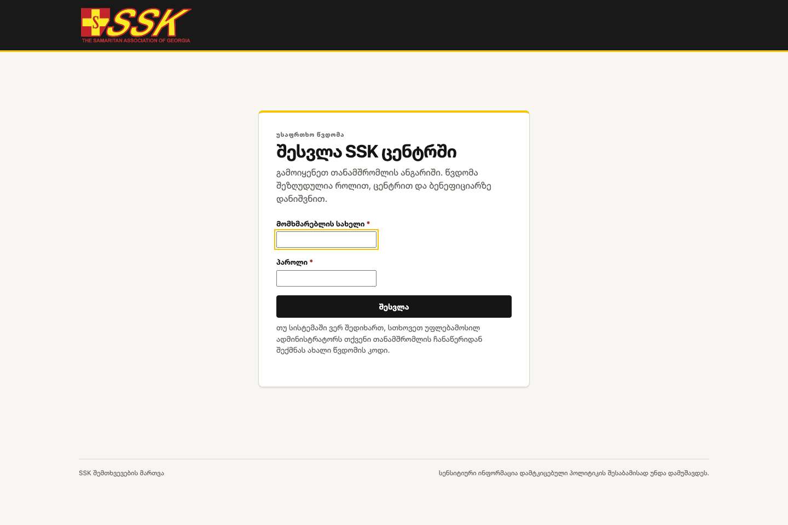

წესები, რომლებიც შესვლასთან დაკავშირებით მოქმედებს:

- პაროლი არავის გადასცეთ, მათ შორის კოლეგებსაც კი. თითოეულ ადამიანს უნდა ჰქონდეს საკუთარი ანგარიში, რადგან ყველა ცვლილება აღირიცხება კონკრეტული მომხმარებლის სახელით.
- ზედიზედ რამდენიმე წარუმატებელი მცდელობის შემდეგ სისტემა დროებით შეაჩერებს შესვლას. გარკვეული დროის შემდეგ ხელახლა სცადეთ.
- პაროლი დაგავიწყდათ? ატყობინეთ თქვენს კოორდინატორს ან სისტემის მენეჯერს. ის გენერირებს ახალ დროებით კოდს (იხ. [განყოფილება 6.3](#63-დროებითი-წვდომის-კოდის-გენერირება)). ძველი პაროლი ამ დროს დაუყოვნებლივ გაუქმდება.

### ენის შეცვლა

სისტემა ორ ენაზე მუშაობს: ქართული და English. ეკრანის ზედა მარჯვენა კუთხეში დააჭირეთ თქვენს სახელს, გახსენით „ენა" ველი, აირჩიეთ ენა და დააჭირეთ „გამოყენება". არჩევანი დამახსოვრდება ბრაუზერში.

### გასვლა

იგივე მენიუში, თქვენს სახელზე დაჭერისას, არის ღილაკი „გასვლა". სამუშაო დღის ბოლოს ან საერთო კომპიუტერზე მუშაობის დასრულებისას აუცილებლად გამოხვიდეთ სისტემიდან.

---

## 3. პირველი შესვლა: საკუთარი პაროლის დაყენება

როცა ადმინისტრატორი გაძლევთ დროებით წვდომის კოდს, პირველი შესვლა სწორედ ამ კოდით ხდება. სისტემა დაუყოვნებლივ მოგთხოვთ საკუთარი პაროლის დაყენებას:

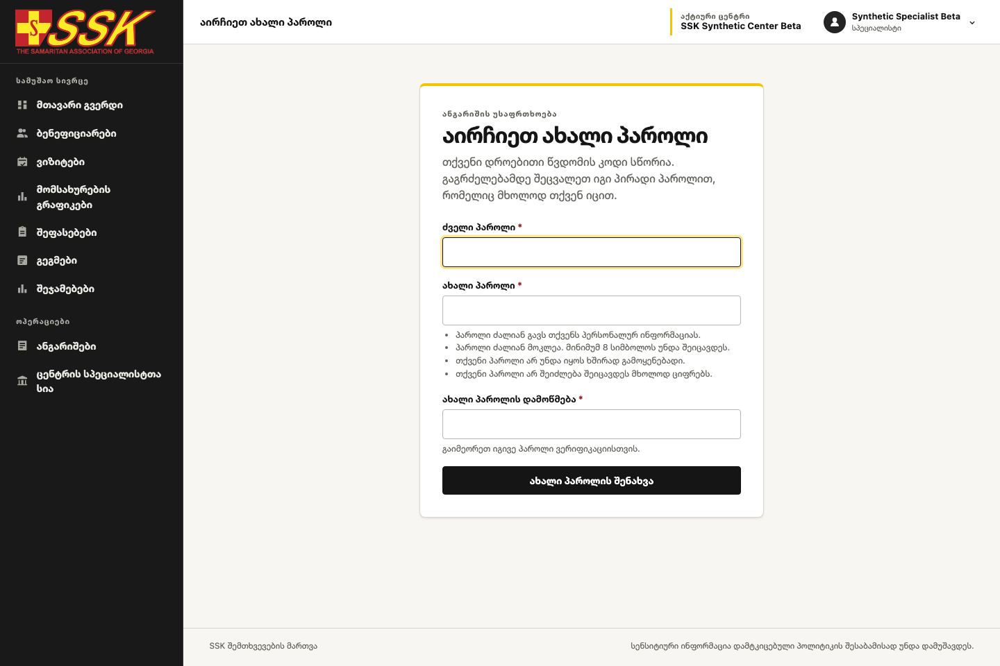

1. ველში „მიმდინარე პაროლი" შეიყვანეთ დროებითი კოდი, რომელიც ადმინისტრატორმა გადასცა.
2. ველში „ახალი პაროლი" და შემდეგ „ახალი პაროლის დადასტურება" შეიყვანეთ თქვენი ახალი პაროლი.
3. დააჭირეთ „ახალი პაროლის ცვლილება".

მოთხოვნები ახალ პაროლზე:

- მინიმუმ 8 სიმბოლო;
- არ უნდა ჰგავდეს თქვენს სახელს ან ელფოსტას;
- არ უნდა იყოს გავრცელებული პაროლი;
- არ უნდა შედგებოდეს მხოლოდ ციფრებისგან.

დროებითი კოდი ერთხელ მოქმედებს: პაროლის შეცვლის შემდეგ ის აღარ გამოდგება.

---

## 4. აქტიური ცენტრის არჩევა

სისტემა მოქმედებს ცენტრების მიხედვით: ბენეფიციარი, ჩარიცხვა, ვიზიტი და ანგარიში ყოველთვის კონკრეტულ ცენტრს ეკუთვნის. შესვლის შემდეგ სისტემა გთხოვს აირჩიოთ აქტიური ცენტრი:

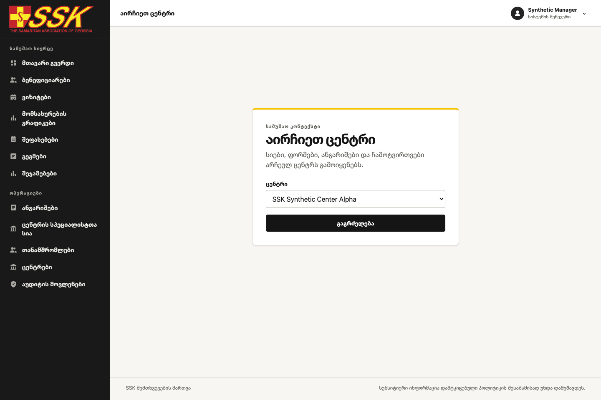

- ჩამოსაშლელ სიაში აირჩიეთ ცენტრი და დააჭირეთ „გაგრძელება".
- არჩეული ცენტრი ზედა პანელზე ჩანს წარწერით „აქტიური ცენტრი". მასზე დაჭერით ნებისმიერ დროს შეგიძლიათ ცენტრის შეცვლა.
- სიები, ფორმები, ანგარიშები და CSV ჩამოტვირთვა ყოველთვის აქტიური ცენტრის მონაცემებს აჩვენებს.

თუ მომხმარებელი ორ ცენტრშივე მუშაობს (მაგალითად სპეციალისტი, რომელიც ორივე ცენტრშია გაწერილი), მას ორივე ვარიანტი ექნება სიაში და თავად გადაერთვის საჭიროების მიხედვით. წვდომა ყოველთვის მხოლოდ იმ ცენტრებზე ვრცელდება, სადაც ის ოფიციალურადაა გაწერილი.

---

## 5. მთავარი გვერდი

შესვლის და ცენტრის არჩევის შემდეგ იხსნება „მთავარი გვერდი":

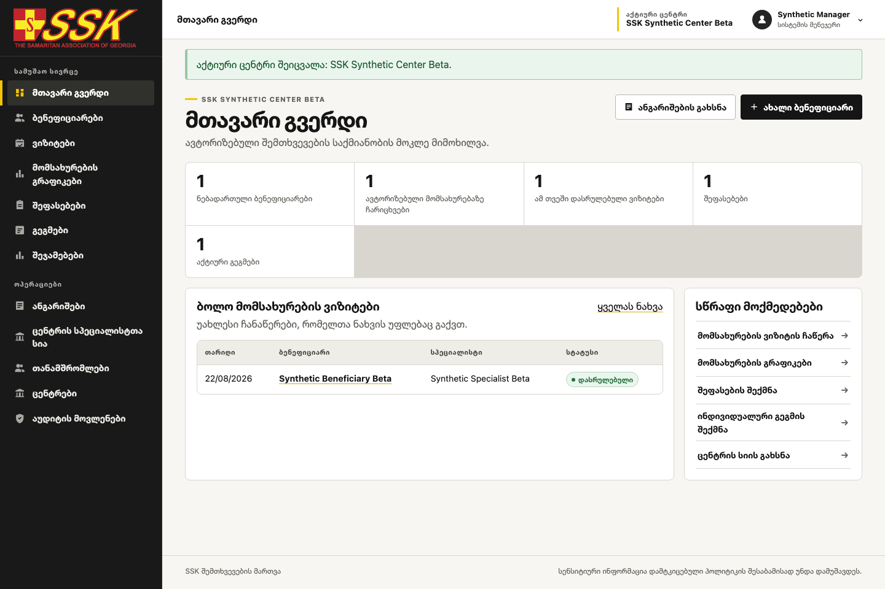

აქ ჩანს:

- **მიმდინარე ბენეფიციარები**: რამდენი აქტიური ბენეფიციარია ცენტრში;
- **მომსახურებაში მყოფი შემთხვევები**: აქტიური ჩარიცხვების რაოდენობა;
- **ამ თვეში დაგეგმილი ვიზიტები** და **შეჯამებები**: მიმდინარე თვის მაჩვენებლები;
- **ბოლო მომსახურების ვიზიტები**: ბოლო ჩანაწერები თარიღით, ბენეფიციარით, სპეციალისტით და სტატუსით;
- მარჯვენა მხარეს სწრაფი ბმულები: ბენეფიციარების სია, შეფასებები, გეგმები, დაგეგმილი და გაწეული მომსახურების ანგარიში, ცენტრის სია.

მენიუ (მარცხენა პანელი) როლის მიხედვით იცვლება: სპეციალისტს მხოლოდ სამუშაო განყოფილება ეჩვენება, კოორდინატორს და მენეჯერს დაემატება „ოპერაციები" (ანგარიშები, ცენტრის სპეციალისტთა სია, თანამშრომლები), ხოლო მენეჯერს ასევე „ცენტრები" და „აუდიტის მოვლენები".

---

## 6. სისტემის მენეჯერის გზამკვლევი

სისტემის მენეჯერი აწყობს სისტემის ჩონჩხს: ქმნის ცენტრებს, არეგისტრირებს თანამშრომლებს, გასცემს წვდომებს და აკონტროლებს აუდიტს.

### 6.1 ცენტრების შექმნა და რედაქტირება

მენიუში „ცენტრები" აჩვენებს ყველა ცენტრის სიას:

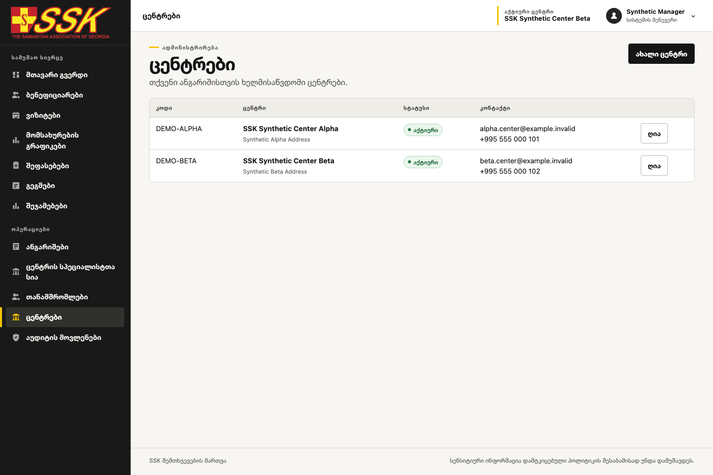

ახალი ცენტრის შესაქმნელად დააჭირეთ „ახალი ცენტრის დამატება" და შეავსეთ ფორმა: კოდი, დასახელება, ელფოსტა, ტელეფონი, მისამართი, მოქმედების სტატუსი:

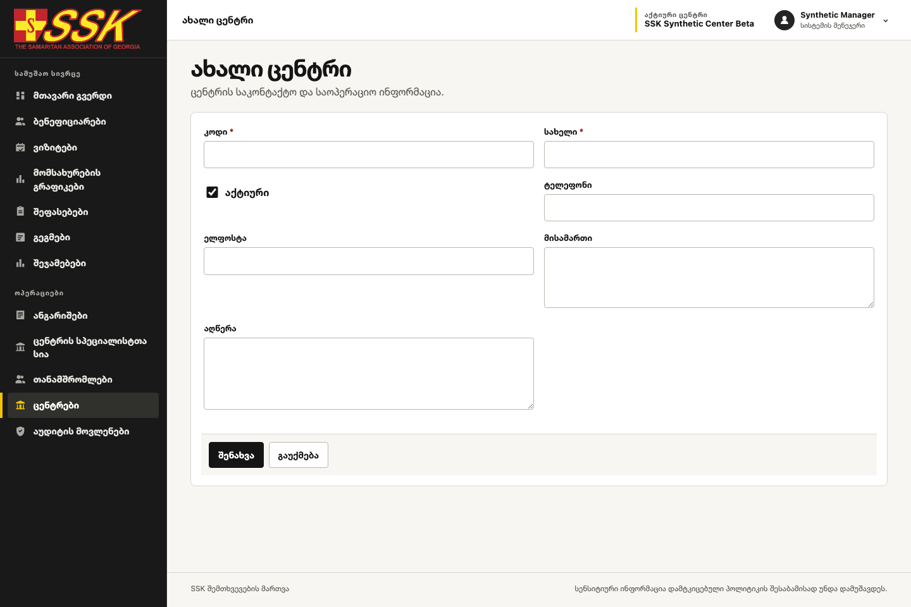

ცენტრის გვერდი („ცენტრის სპეციალისტთა სია") აჩვენებს ამ ცენტრში გაწერილ სპეციალისტებს. აქვე შეგიძლიათ:

- ახალი სპეციალისტის ანგარიშის შექმნა ან არსებულის მიბმა ამ ცენტრთან;
- მინიჭების რედაქტირება ან გაუქმება.

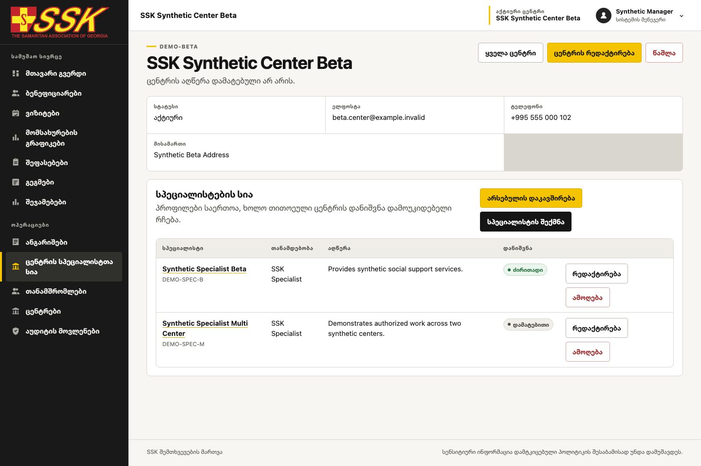

### 6.2 თანამშრომლების რეესტრი

მენიუში „თანამშრომლები" არის ყველა თანამშრომლის სია:

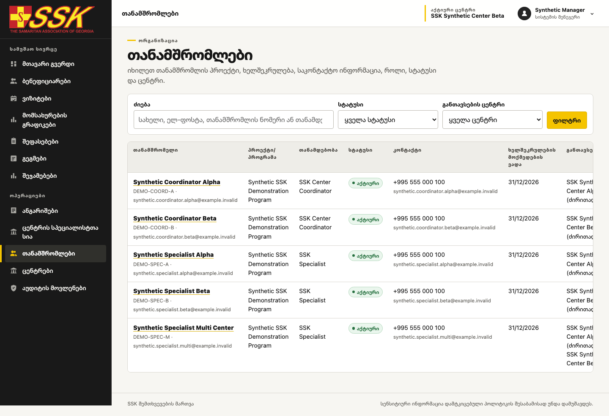

თანამშრომლის გვერდზე ჩანს: თანამდებობა, სტატუსი, პერსონალური ნომერი, ხელშეკრულების თარიღები, ძირითადი ცენტრი, ცენტრები, სადაც ის გაწერილია, აპლიკაციის როლი და ანგარიშის მდგომარეობა:

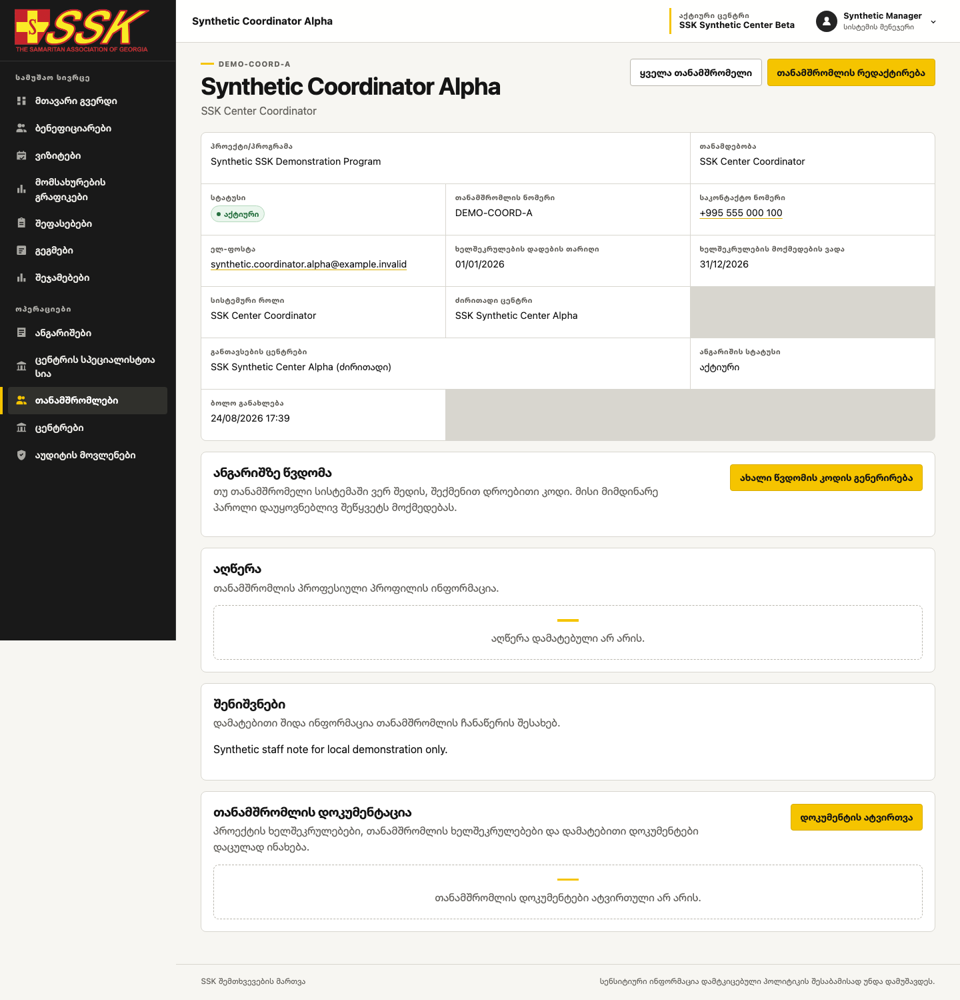

აქვე ხდება:

- **რედაქტირება**: თანამშრომლის მონაცემების შეცვლა;
- **დოკუმენტები**: ხელშეკრულებების და სხვა ფაილების ატვირთვა. ფაილები ინახება დახურულად და ჩამოტვირთვა მხოლოდ უფლებამოსილ მომხმარებლებს შეუძლიათ;
- **ანგარიშის გამორთვა**: თანამშრომლის მონაცემებში ანგარიშის არააქტიურად მონიშვნა მას სისტემაში შესვლის საშუალებას ართმევს.

### 6.3 დროებითი წვდომის კოდის გენერირება

როცა ახალი თანამშრომელი უნდა მიიწვიოთ სისტემაში, ან როცა ვინმემ პაროლი დაკარგა, თანამშრომლის გვერდზე დააჭირეთ ღილაკს „ახალი წვდომის კოდის გენერირება":

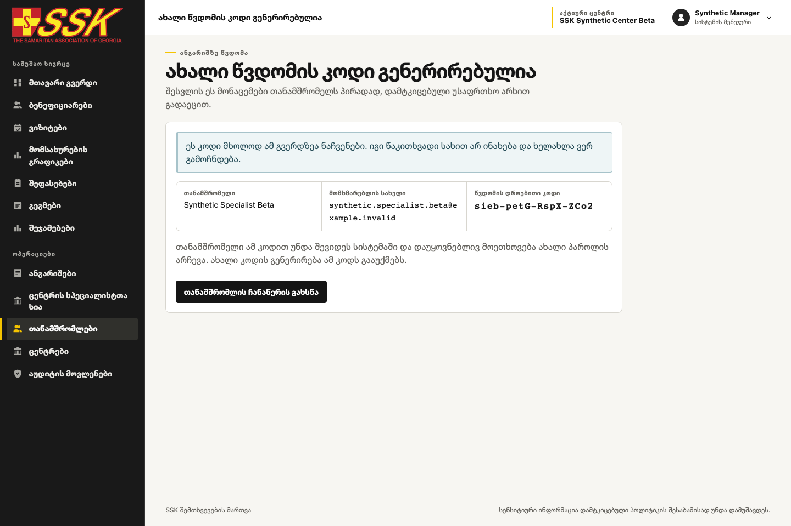

სისტემა აჩვენებს დროებით კოდს, მაგალითად `PCEK-ZJKZ-NESW-RBZ2`. წესები:

- კოდი ერთხელ ჩანს და ინახება მხოლოდ ამ ეკრანზე. ხელახლა ვერ ნახავთ;
- კოდი ჩამოუტანეთ თანამშრომელს დამტკიცებული უსაფრთხო არხით (პირადად ან ტელეფონით). ჩატი ან ელფოსტა რეკომენდებული არ არის;
- თანამშრომელი ამ კოდით პირველად შედის სისტემაში და დაუყოვნებლივ ირჩევს საკუთარ პაროლს (იხ. [განყოფილება 3](#3-პირველი-შესვლა-საკუთარი-პაროლის-დაყენება));
- ახალი კოდის გენერირება ძველ პაროლს და ძველ კოდს დაუყოვნებლივ აუქმებს;
- საკუთარ ანგარიშზე კოდის გენერირება აკრძალულია.

### 6.4 აუდიტის მოვლენები

მენიუში „აუდიტის მოვლენები" არის სისტემის ჟურნალი: ვინ, როდის და რა შეცვლა, რა ფაილი ჩამოტვირთა, რა ანგარიში გამოიტანა და სად ჰქონდა წვდომა უარყოფილი:

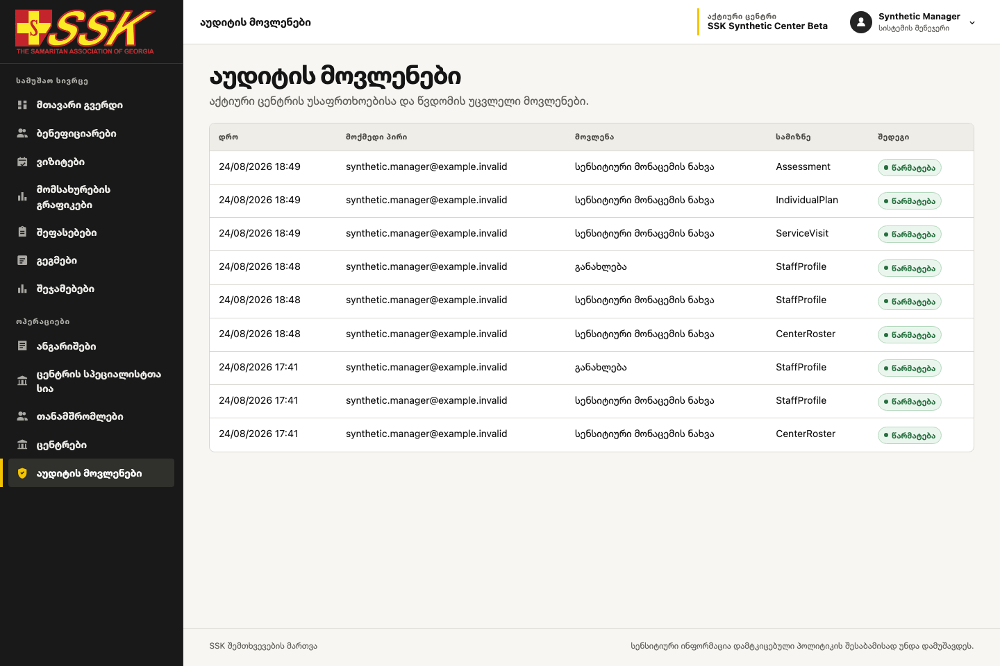

ეს გვერდი მხოლოდ სისტემის მენეჯერს ჩანს და ჩანაწერების წაშლა ან რედაქტირება ვერ ხერხდება.

---

## 7. ცენტრის კოორდინატორის გზამკვლევი

კოორდინატორი მართავს თავისი ცენტრის ყოველდღიურ საქმიანობას: ბენეფიციარებს, ჩარიცხვებს, ვიზიტებს, შეფასებებს, გეგმებს და ანგარიშებს.

### 7.1 ბენეფიციარის რეგისტრაცია

მენიუში „ბენეფიციარები" არის ცენტრის ბენეფიციართა სია. ზედა ღილაკით „ახალი ბენეფიციარი" იხსნება რეგისტრაციის ფორმა:

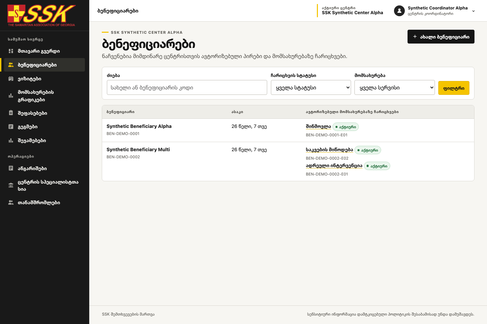

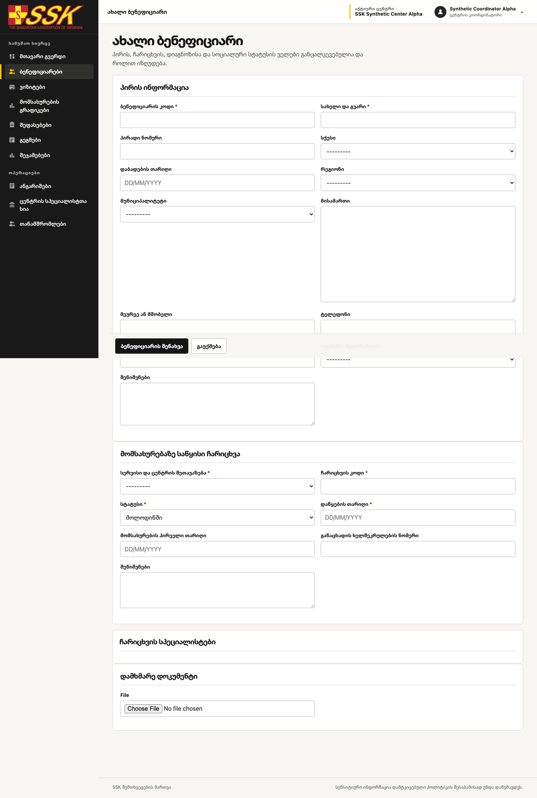

ფორმაში შედის: ბენეფიციარის კოდი, სახელი და გვარი, დაბადების თარიღი, პირადი ნომერი, საკონტაქტო მონაცემები, მეურვე/მშობელი, მისამართი, დიაგნოზის სტატუსი და შენიშვნები. თარიღები შეჰყავთ ფორმატში `DD/MM/YYYY`.

### 7.2 ბენეფიციარის გვერდი

ბენეფიციარის სახელზე დაჭერით იხსნება მისი მთლიანი საქმე:

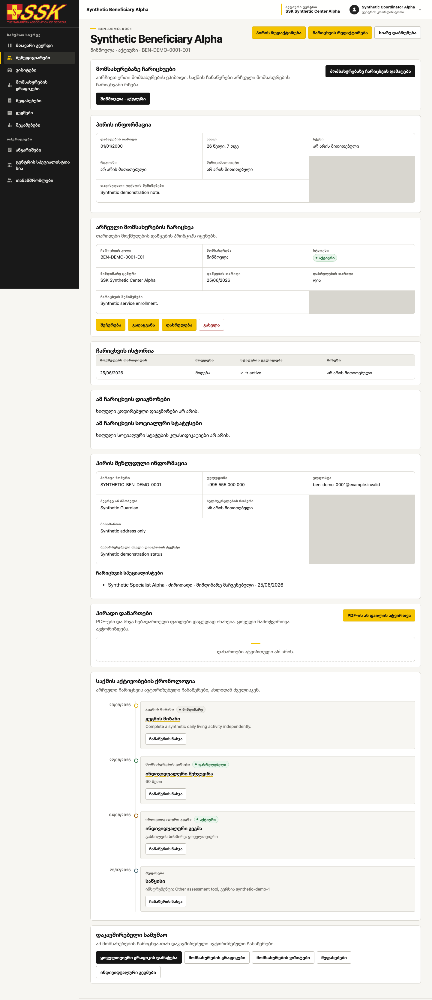

გვერდი რამდენიმე ბლოკისგან შედგება:

- **მომსახურების ისტორიები (ჩარიცხვები)**: თითოეული ჩარიცხვის კოდი, სტატუსი, ცენტრი, თარიღები და ღილაკები „რედაქტირება", „გადაყვანა", „გასვლა", „ხელახალი ჩარიცხვა";
- **ჩარიცხვის მდგომარეობის ისტორია**: თარიღებთან ერთად, როგორ იცვლებოდა სტატუსი (მაგალითად „შემოსვლა" და „active");
- **და ჩარიცხვის დანართები / საქმის დოკუმენტები**: ფაილების ატვირთვა და ჩამოტვირთვა;
- **დაუცველი მონაცემები**: პირადი ნომერი, მისამართი, ტელეფონი, ელფოსტა, მეურვე. ეს ბლოკი მხოლოდ კოორდინატორს და მენეჯერს ჩანს, სპეციალისტს არასოდეს;
- **მინიჭებული სპეციალისტები**: ვინ არის ბენეფიციარზე გაწერილი და რომელი თარიღიდან;
- **აქტივობების დროის ხაზი**: ქრონოლოგიურად ყველა ვიზიტი, შეფასება, გეგმა და მიზანი;
- **PDF ღილაკი**: საქმის მთლიანი ანაბეჭდის ჩამოტვირთვა.

### 7.3 ჩარიცხვის სასიცოცხლო ციკლი

ბენეფიციარი მომსახურებაზე „ჩარიცხვით" შედის და თითოეულ ჩარიცხვას აქვს საკუთარი ისტორია:

1. **ახალი ჩარიცხვა**: ბენეფიციარის გვერდიდან „ახალი ჩარიცხვა", სადაც ირჩევთ მომსახურებას, დაწყების თარიღს და სპეციალისტს;
2. **გადაყვანა**: ბენეფიციარის სხვა ცენტრში გადაყვანა. ძველი ისტორია ინახება;
3. **გასვლა**: მომსახურების დასრულება გასვლის თარიღით და მიზეზით;
4. **ხელახალი ჩარიცხვა**: იმავე ბენეფიციარის ახალი ეპიზოდი მოგვიანებით. წინა ეპიზოდები ხედში რჩება.

წესი: ჩანაწერები იქმნება „მოქმედების თარიღის" მიხედვით. თუ ჩარიცხვა უკვე დასრულებულია ან ბენეფიციარი გადაყვანილია, სისტემა ახალ ჩანაწერებს იქ აღარ დაუშვებს.

### 7.4 მომსახურების გრაფიკები

მენიუში „მომსახურების გრაფიკები" გეგმავს თვიურ მოცულობას: რომელი აქტივობით, რამდენი ვიზიტი და ერთეულია დაგეგმილი თითოეული ჩარიცხვისთვის კონკრეტულ თვეში:

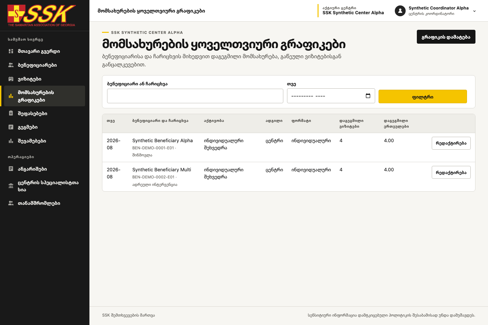

გრაფიკი საფუძველია „დაგეგმილი და გაწეული მომსახურების" ანგარიშისთვის: სისტემა შეადარებს დაგეგმილს რეალურად გაწეულ ვიზიტებს.

### 7.5 ვიზიტები

მენიუში „ვიზიტები" არის ყველა გაწეული ვიზიტის სია ფილტრებით:

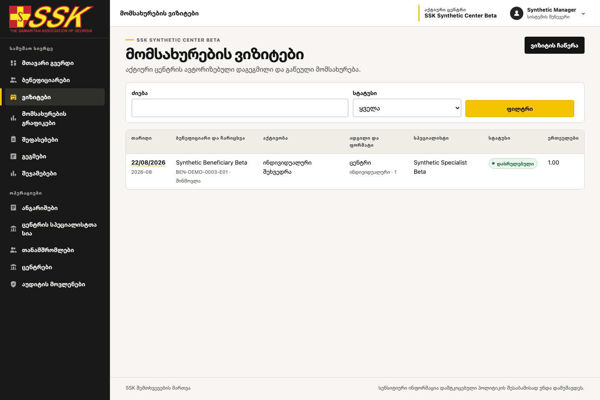

ახალი ვიზიტის დამატება შეუძლიათ როგორც კოორდინატორს, ასევე სპეციალისტს („ახალი ვიზიტი"). ვიზიტში ფიქსირდება: ბენეფიციარი, ჩარიცხვა, თარიღი, აქტივობა, ადგილი, მონაწილეობის ფორმა, ერთეულები, ხანგრძლივობა, სპეციალისტი და სტატუსი (დაგეგმილი, დასრულებული, გაუქმებული):

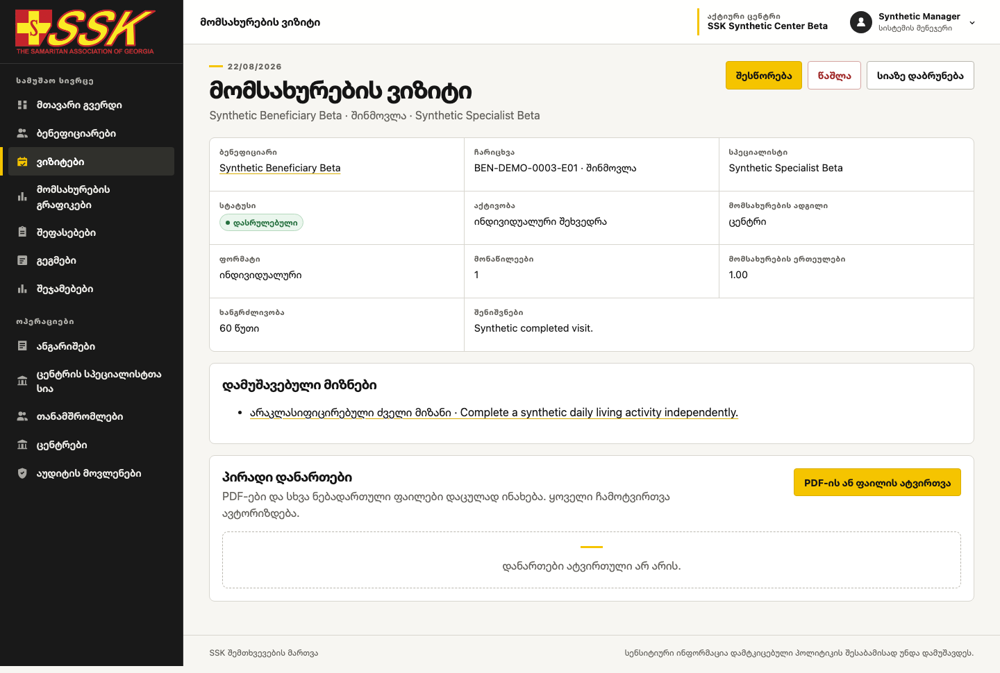

ვიზიტის გვერდზე ასევე შესაძლებელია დანართების ატვირთვა (მაგალითად გაწეული სამუშაოს ფოტო ან აქტი).

### 7.6 შეფასებები

მენიუში „შეფასებები" არის ბენეფიციართა შეფასების დოკუმენტები:

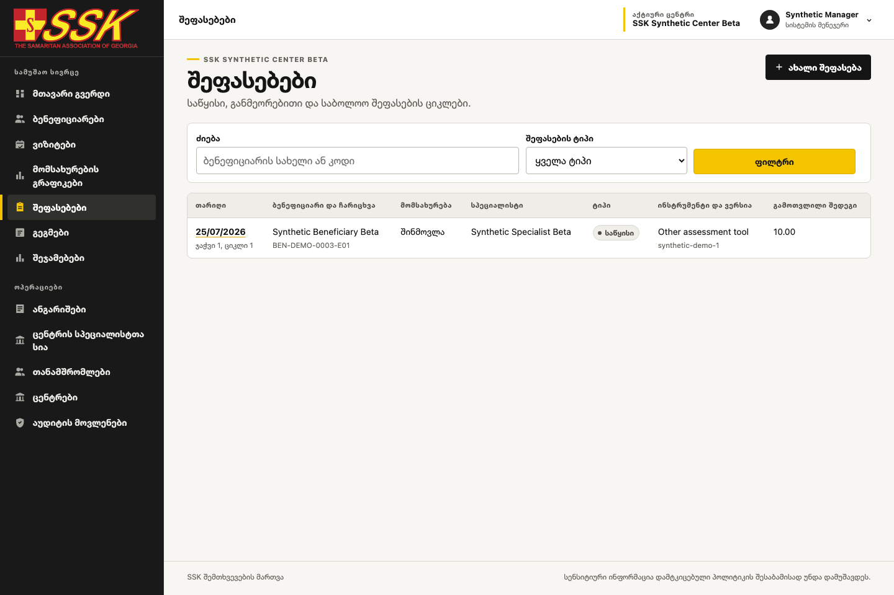

შეფასება იქმნება ნაწილობრივ შაბლონით: ირჩევენ შაბლონს, შეჰყავთ პასუხები (მაგალითად ქულები), სისტემა თვითონ ითვლის ჯამურ ქულებს სექციების მიხედვით. შეფასება ჯერ დროებითი (დრაფტი) არის და დასრულების შემდეგ გახდება საბოლოო:

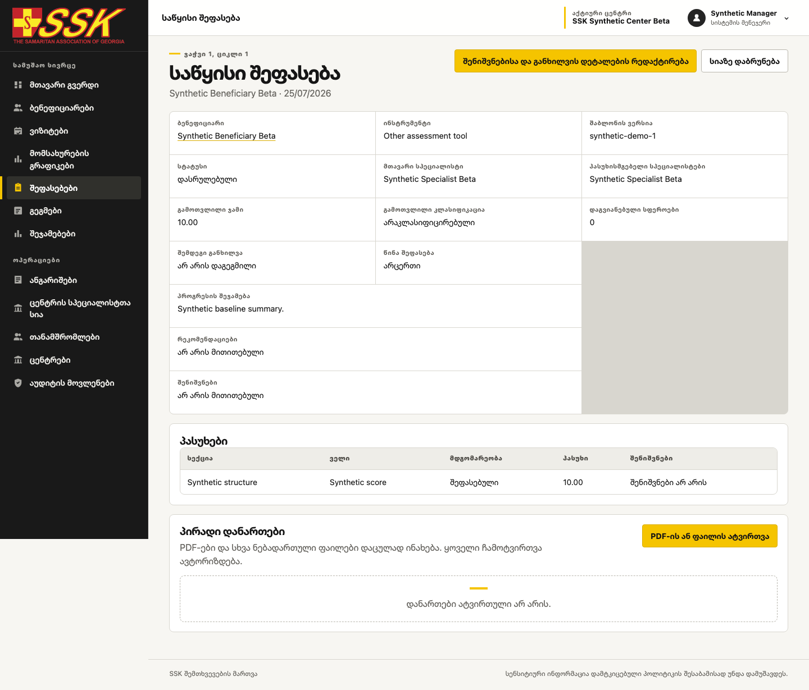

### 7.7 გეგმები (ინდივიდუალური გეგმები)

მენიუში „გეგმები" არის ინდივიდუალური გეგმების სია:

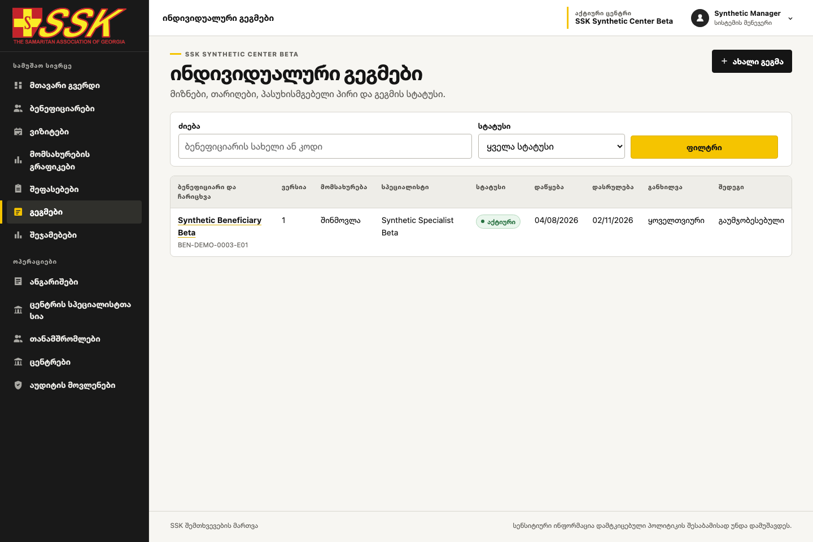

გეგმაში შედის: ბენეფიციარი, სპეციალისტი, დაწყების და დასრულების თარიღები, განხილვის სიხშირე, სტატუსი და მიზნები:

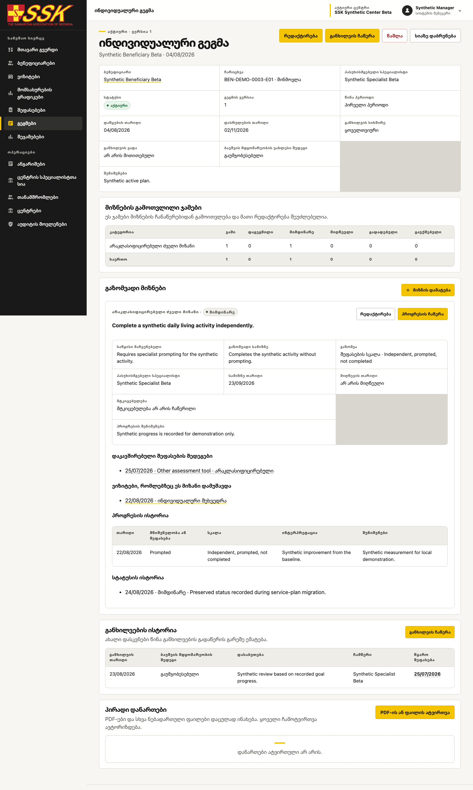

გეგმის გვერდზე:

- **მიზნების პროგრესის ცხრილი**: სულ, დაგეგმილი, მიმდინარე, მიღწეული მიზნების მაჩვენებლები;
- **თითოეული მიზანი**: საწყისი მდგომარეობა, მოსალოდნელი შედეგი, პასუხისმგებელი სპეციალისტი, სამიზნე თარიღი, გაზომვები და სტატუსების ისტორია;
- **გეგმის განხილვები**: პერიოდული მიმოხილვები დასკვნით;
- **ვერსიები**: გეგმის მნიშვნელოვანი ცვლილებისას შეიძლება ახალი ვერსიის შექმნა, ძველი ისტორიაში რჩება;
- **დანართები და PDF**.

### 7.8 შეჯამებები

მენიუში „შეჯამებები" არის სპეციალისტთა ყოველთვიური შეჯამებული შედეგები. თვის მიხედვით ფილტრავს თვის ამორჩევით და თითოეული სპეციალისტისთვის აჩვენებს: დაგეგმილ და დასრულებულ ვიზიტებს, გაწეულ ერთეულებს, წუთებს, ბენეფიციარებს, გამოტოვებულ და გაუქმებულ ვიზიტებს:

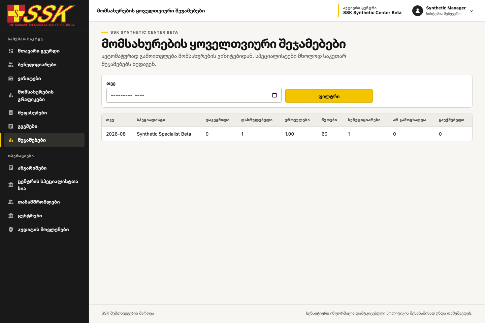

### 7.9 ანგარიშები და CSV ექსპორტი

მენიუში „ანგარიშები" შეგიძლიათ აირჩიოთ ექვსი ანგარიშიდან ერთი: ბენეფიციარები, მომსახურებაზე ჩარიცხვები, ვიზიტები, დაგეგმილი და გაწეული მომსახურება, შეფასებები, გეგმები:

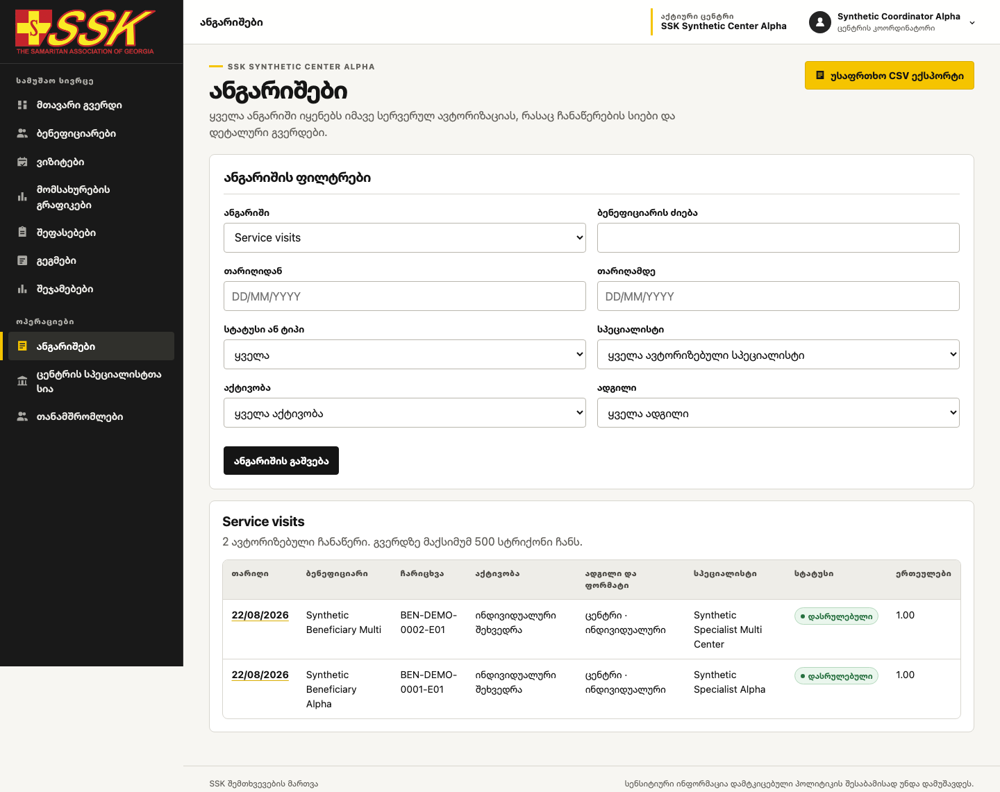

ფილტრები: სიტყვით ძიება, თარიღები „დან" და „მდე", სპეციალისტი, სტატუსი. ღილაკით „ანგარიშების CSV ჩამოტვირთვა" მონაცემები ჩამოიტვირთება Excel-ში გასახსნელ ფაილად.

წესი: CSV ექსპორტი ხედავს მხოლოდ თქვენი აქტიური ცენტრის მონაცემებს. სპეციალისტს CSV ექსპორტი არ აქვს.

---

## 8. სპეციალისტის გზამკვლევი

სპეციალისტი ხედავს მხოლოდ იმ შემთხვევებს, რომლებზეც მას მოქმედი მინიჭება აქვს:

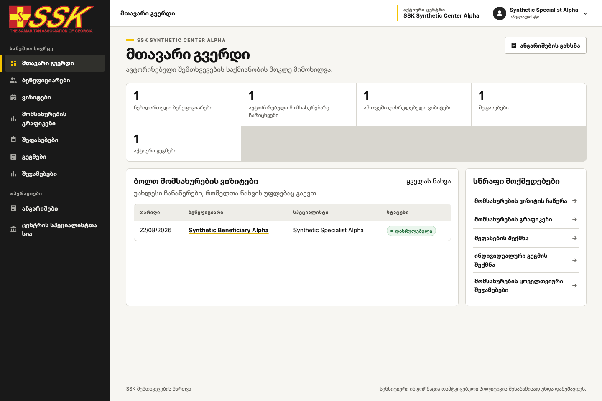

რა შეუძლია სპეციალისტს:

- ნახოს მისი ბენეფიციარების ჩანაწერები: ვიზიტები, შეფასებები, გეგმები, შეჯამებები, მათ შორის წინა პერიოდების დამტკიცებული ისტორია;

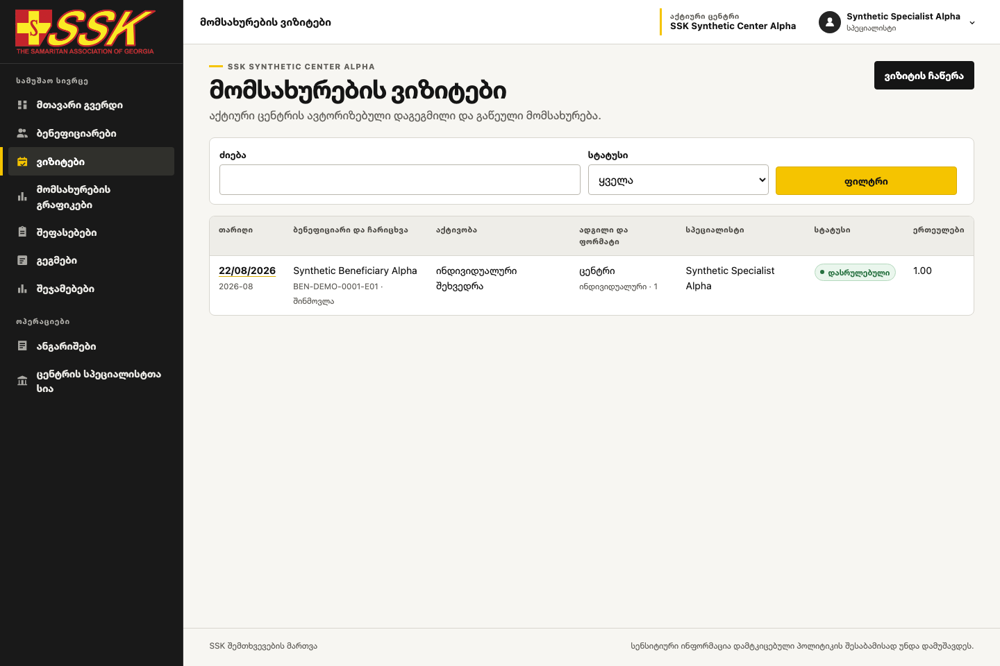

- შეავსოს ვიზიტი, შეფასება, გეგმა და ყოველთვიური შეჯამება თავისი ბენეფიციარებისთვის:

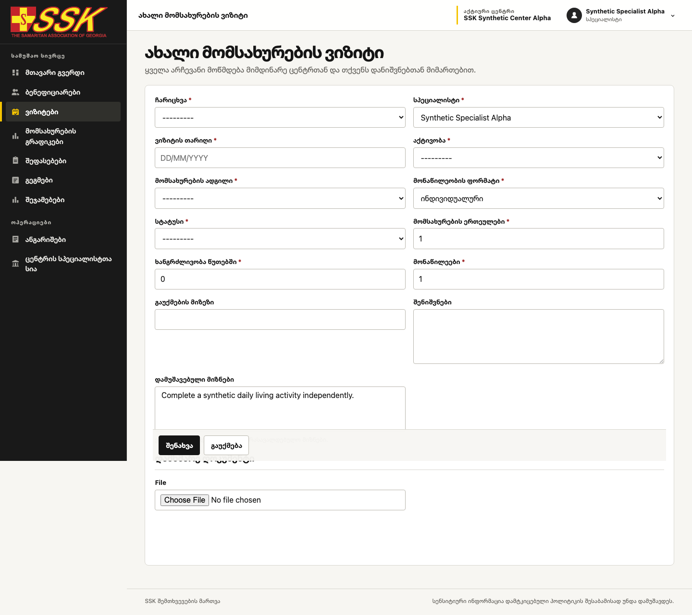

რა არ შეუძლია სპეციალისტს:

- ბენეფიციარის დაუცველი მონაცემების ნახვა (პირადი ნომერი, მისამართი, ტელეფონი, მეურვე);
- ბენეფიციარის ფაილებზე წვდომა;
- ჩარიცხვის შექმნა, გადაყვანა ან დახურვა;
- სხვა ცენტრის ან სხვა სპეციალისტის ბენეფიციარზე წვდომა;
- CSV ექსპორტი.

მნიშვნელოვანი წესი თარიღებზე: ჩანაწერის (ვიზიტი, შეფასება, გეგმა) შექმნა ან შეცვლა სისტემა გადაამოწმებს, რომ სპეციალისტი ჩანაწერის თარიღზეც იყო გაწერილი ამ ბენეფიციარზე. თუ მინიჭება მოგვიანებით დაიწყო ან დასრულდა, ძველ თარიღზე ცვლილება არ მოხდება.

---

## 9. უსაფრთხოების წესები, რომლებიც ყველამ უნდა იცოდეს

- **ერთი ადამიანი, ერთი ანგარიში.** საკუთარი პაროლი არავის გადაეცემა. საერთო ანგარიში აკრძალულია.
- **ყველაფერი იწერება.** შესვლა, ცვლილებები, ჩამოტვირთვები, ექსპორტები და უარყოფილი წვდომები ფიქსირდება აუდიტში.
- **დაუცველი მონაცემები** (პირადი ნომერი, მისამართი, ტელეფონი, ელფოსტა, მეურვე, ხელშეკრულების ნომერი) მხოლოდ კოორდინატორს და მენეჯერს ხედავს.
- **ფაილები დახურულია.** დანართებს ბმული არ აქვს და ინტერნეტში ვერ ვრცელდება. ჩამოტვირთვა მხოლოდ უფლებამოსილი ანგარიშით ხდება.
- **ცენტრები იზოლირებულია.** კოორდინატორი მხოლოდ თავის ცენტრს ხედავს, სპეციალისტი მხოლოდ თავის მინიჭებებს.
- **გასვლა** საერთო კომპიუტერზე მუშაობის ბოლოს აუცილებელია.
- **ეჭვი შეგეპარათ ანგარიშზე?** დაუყოვნებლივ ატყობინეთ მენეჯერს: ის გენერირებს ახალ წვდომის კოდს და ძველი პაროლი მაშინვე გაუქმდება.

---

## 10. ხშირად დასმული კითხვები

**პაროლი დამავიწყდა. რა ვქნა?**
ატყობინეთ კოორდინატორს ან სისტემის მენეჯერს. ის თქვენს პროფილზე გენერირებს დროებით კოდს, კოდით შეხვალთ და დააყენებთ ახალ პაროლს.

**„გვერდი ვერ მოიძებნა" ან წვდომის შეცდომა მიჩვენა. დაირღვა სისტემა?**
არა. ეს ნიშნავს, რომ ეს გვერდი ან ჩანაწერი თქვენს როლს არ ეკუთვნის. მაგალითად სპეციალისტს სხვა სპეციალისტის ბენეფიციარი ასე ჩაეკეტება.

**რატომ არ მესახება „ცენტრები" ან „თანამშრომლები" მენიუში?**
ეს განყოფილებები მხოლოდ სისტემის მენეჯერს და, შესაბამისად, HR-ს ჩანს.

**რომელ ფორმატში შევიყვანო თარიღები?**
`DD/MM/YYYY`, მაგალითად `04/08/2026`.

**როგორ გადავიყვანო ბენეფიციარი მეორე ცენტრში?**
ბენეფიციარის გვერდზე, ჩარიცხვის ბლოკში, დააჭირეთ „გადაყვანა" და მიუთითეთ ახალი ცენტრი და თარიღი. ისტორია ინახება.

**ვინ ხედავს ჩემს მიერ შეყვანილ მონაცემებს?**
თქვენი ცენტრის კოორდინატორი და სისტემის მენეჯერი, ასევე ბენეფიციარზე გაწერილი სპეციალისტები თავისი ნაწილის ფარგლებში. ყველა ნახვა და ცვლილება აუდიტში ფიქსირდება.

**შემიძლია თუ არა ჩანაწერის წაშლა?**
ვიზიტის წაშლა შეუძლია მენეჯერს. ბენეფიციარის წაშლა მხოლოდ მისი ცენტრის მენეჯერს შეუძლია. კოორდინატორს და სპეციალისტს ჩანაწერების წაშლის უფლება არ აქვს, რადგან ისტორიის ხელუხლებელობა მნიშვნელოვანია.

---

*დოკუმენტი შედგენია სისტემის მიმდინარე ვერსიაზე დაყრდნობით. ეკრანის სურათები სინთეზური სადემონსტრაციო მონაცემებითაა გადაღებული.*
